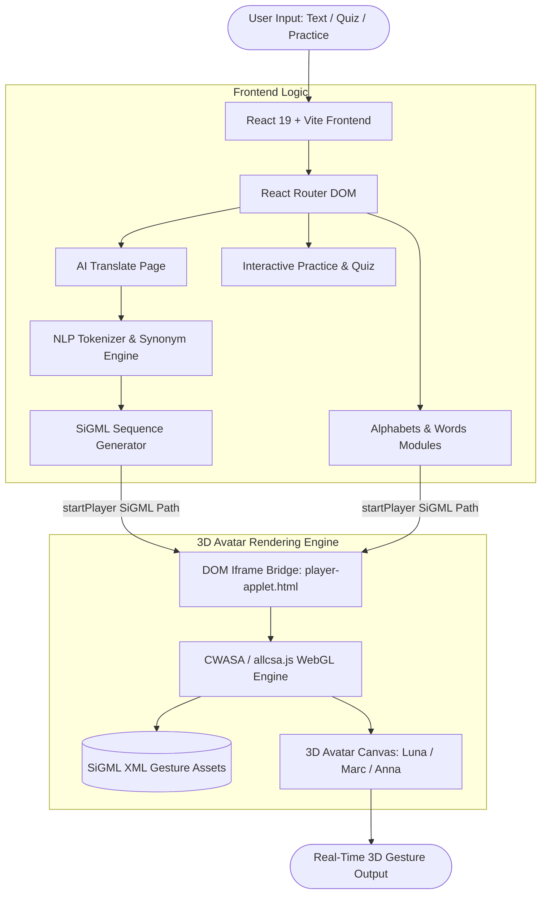

# 🤟 SignVerse — 3D Sign Language Learning & Translation Platform

[](https://reactjs.org/)
[](https://vitejs.dev/)
[](http://vhg.cmp.uea.ac.uk/tech/jas/vhg2017/)
[](LICENSE)
[]()

> **SignVerse** is an interactive, web-based 3D Sign Language Learning and Translation platform designed to bridge communication gaps for the Deaf and Hard-of-Hearing community. By transforming natural text into fluid 3D avatar animations in real time, SignVerse makes sign language accessible, engaging, and easy to learn.

---

## 🌟 Key Highlights & Hackathon Pitch

- ⚡ **Zero-Latency Client-Side 3D Synthesis**: Uses the lightweight **JASign / CWASA (Computer Animation of Signing Avatars)** engine developed by the University of East Anglia (UEA). Renders realistic 3D avatars directly in WebGL without heavy server-side GPU rendering.
- 🎙️ **Real-Time Voice-to-Sign Translation**: Integrated Web Speech Recognition API allows users to speak into their microphone; converts speech to text in real time, processes synonyms, and auto-animates the 3D avatar.
- 🤖 **Interactive SignAI Chatbot Assistant**: Built-in 24/7 AI Guide supporting voice input, text-to-speech audio, smart query resolution, and direct in-app navigation across all learning modules.
- 🔤 **Smart AI Translation Pipeline**: Parses complex English sentences, resolves words via custom synonym mapping, and automatically falls back to letter-by-letter fingerspelling when exact vocabulary signs are unavailable.
- 📚 **Comprehensive Learning Modules**: Interactive modules for Alphabet fingerspelling (A–Z), core vocabulary words, practice exercises, timed quizzes, and learner progress tracking dashboards.
- 🎛️ **Granular Avatar Control**: Change avatars (*Luna*, *Marc*, *Anna*, *Siggi*, *Francoise*), adjust signing speed (Fast, Normal, Slow, Very Slow), and pause/resume gestures for optimal comprehension.

---

## 🏗️ System Architecture



---

## 🚀 How the 3D Engine Magic Works

Instead of shipping heavy 3D `.glb` / `.fbx` models that cause slow load times, **SignVerse** uses **SiGML (Signing Gesture Markup Language)** — an XML-compliant notation for describing sign language gestures based on HamNoSys (Hamburg Notation System).

1. **The Avatar Host (`player-applet.html`)**:
   - Resides in the `/public` directory.
   - Initialized with UEA's `allcsa.js` and `cwasa.css` WebGL libraries.
   - Exposes JavaScript controller functions (`startPlayer(sigmlURL)` and `playText(stext)`).

2. **The React-to-Iframe Communication Bridge**:
   - React components hold a `useRef` reference to the embedded iframe.
   - When a user inputs text or selects a sign, the React translation pipeline executes:
     ```javascript
     iframeRef.current.contentWindow.startPlayer(`SignFiles/${signName}.sigml`);
     ```

3. **Intelligent Fallback Translation Algorithm**:
   - **Step 1 (Direct Match)**: Matches tokenized words against the local vocabulary dataset (`modulesData.json`).
   - **Step 2 (Synonym Mapping)**: Maps common synonyms (e.g., `"dad"` ➔ `"father"`, `"glad"` ➔ `"happy"`).
   - **Step 3 (Fingerspelling Fallback)**: Automatically breaks unmatched words into letters and gestures them sequentially with customizable timing delays.

---

## 📂 Project Structure

```text
SignVerse/
├── public/                     # Static assets served by Vite
│   ├── player-applet.html      # 3D CWASA avatar player applet
│   ├── SignFiles/              # SiGML gesture definition files (A-Z, common signs)
│   ├── DictionarySigns/        # Extended vocabulary gesture definitions
│   ├── DictionaryMovies/       # Reference media
│   └── avatars/                # Avatar configurations & textures
├── src/
│   ├── assets/                 # Frontend UI image & icon assets
│   ├── pages/
│   │   ├── Home.jsx            # Landing page with hero banner & feature highlights
│   │   ├── Alphabets.jsx       # Interactive A-Z fingerspelling module
│   │   ├── Words.jsx           # Categorized vocabulary learning
│   │   ├── Translate.jsx       # NLP-powered Text-to-Sign translation studio
│   │   ├── Practice.jsx        # Self-assessment practice arena
│   │   ├── Quiz.jsx            # Interactive quiz with scoring
│   │   ├── Dashboard.jsx       # Learner progress & statistics
│   │   ├── About.jsx           # Mission statement & accessibility info
│   │   ├── Login.jsx           # User authentication
│   │   └── Signup.jsx          # Registration
│   ├── App.jsx                 # Top-level routing & auth state management
│   ├── main.jsx                # React DOM root entry point
│   ├── modulesData.json        # Sign language vocabulary & metadata dictionary
│   └── index.css               # Global theme styling
├── package.json                # Project dependencies and npm scripts
├── vite.config.js              # Vite bundler configuration
└── README.md                   # Project documentation
```

---

## 🛠️ Tech Stack & Tools

- **Frontend Framework**: [React 19](https://react.dev/)
- **Build Tool**: [Vite](https://vitejs.dev/)
- **Routing**: [React Router v7](https://reactrouter.com/)
- **3D Gesture Engine**: [CWASA / JASign (University of East Anglia)](http://vhg.cmp.uea.ac.uk/tech/jas/vhg2017/)
- **Data Notation**: SiGML (Signing Gesture Markup Language)
- **Styling**: Modern Vanilla CSS + Responsive Flex/Grid
- **Package Manager**: npm

---

## ⚙️ Local Development Setup

Follow these steps to run SignVerse locally:

### 1. Prerequisites
- **Node.js** (v18.x or higher recommended)
- **npm** (v9.x or higher)
- **Git**

### 2. Clone the Repository
```bash
git clone https://github.com/YOUR_USERNAME/SignVerse.git
cd SignVerse
```

### 3. Install Dependencies
```bash
npm install
```

### 4. Start Development Server
```bash
npm run dev
```
Open your browser and navigate to `http://localhost:5173`.

---

## 🌐 Deployment Guide (Vercel)

The recommended platform for deploying SignVerse is **Vercel** for instant edge deployment and zero-configuration React support.

### Crucial Deployment Considerations:
1. **HTTPS & Mixed Content**:
   Ensure `public/player-applet.html` loads scripts over `https://` (or `//` protocol-relative) so production browsers do not block external avatar assets:
   ```html
   <link rel="stylesheet" href="https://vhg.cmp.uea.ac.uk/tech/jas/vhg2017/cwa/cwasa.css" />
   <script type="text/javascript" src="https://vhg.cmp.uea.ac.uk/tech/jas/vhg2017/cwa/allcsa.js"></script>
   ```

2. **SPA Routing Rewrites (`vercel.json`)**:
   Add a `vercel.json` file in the root to handle client-side routing and prevent 404 errors on page refresh:
   ```json
   {
     "rewrites": [
       { "source": "/(.*)", "destination": "/index.html" }
     ]
   }
   ```

---

## ✨ Implemented Core Features

- [x] **3D Sign Avatar Synthesis**: Zero-latency avatar rendering with SiGML XML notation.
- [x] **NLP Text-to-Sign & Voice-to-Sign**: Natural speech and text input with synonym expansion & fingerspelling fallback.
- [x] **24/7 SignBot AI Assistant**: Groq & Gemini powered multimodal chatbot guide with voice output.
- [x] **Interactive Learning Arena**: Timed quizzes, flashcard practice, and comprehensive A-Z / word dictionaries.
- [x] **Gamification & Analytics**: Daily streak tracking, accuracy graphs, mastery ranks, and 3-day trial credit manager.

---

## 👥 Contributors & Acknowledgements

- **SignVerse Team** — Hackathon Development & Platform Architecture
- **University of East Anglia (UEA) Virtual Humans Group** — Creators of the JASign / CWASA 3D signing avatar framework
